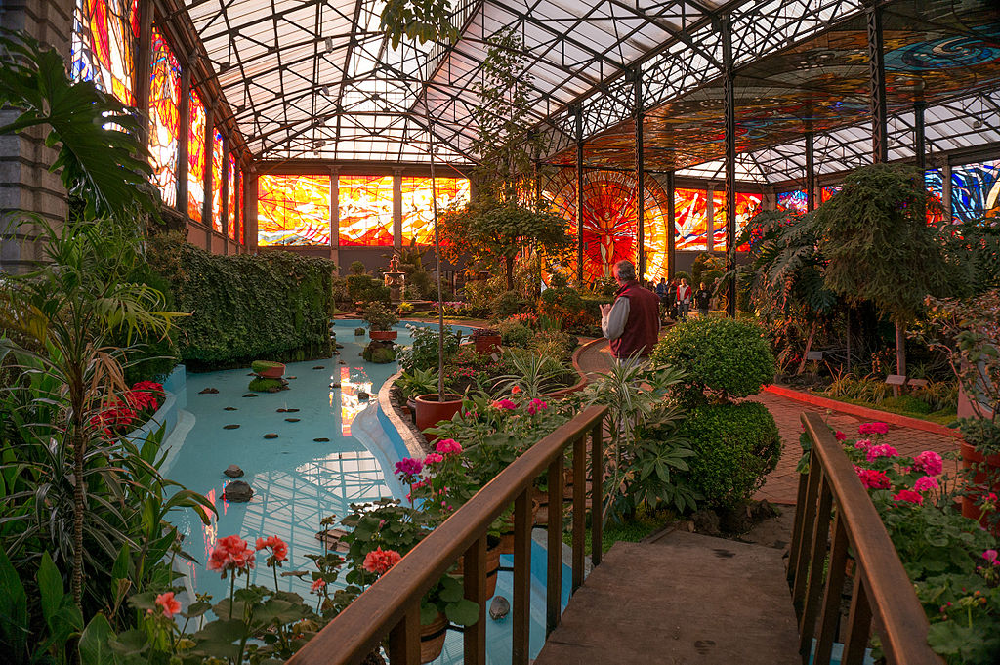

<section id="header">
    <header class="major">
        <h1>{{page.title}}</h1>
        
{{page.description}}

        <a href="#one" class="button special scrolly" style="margin:20px;">Begin</a>
    </header>
    <!-- 

        <ul class="actions">
            <li></li>
        </ul>
    
 -->
</section>
<!-- One -->
<section id="one" class="main special">
    

        <!--  -->
        

            <header class="major">
                <h2>Our Mission</h2>
            </header>
            
At WORC Foods, we know that food is essential, and that feeding our communities is a calling. At the same time, we know that food service is hard work, and that it's the restaurant workers who sacrifice so much to feed the world.
            

            
We want to see a future where our workers see the benefit from innovations that make work easier. Towards that end, we are building a worker-owned cooperative business that seeks to automate the most laborious tasks in food preparation, and pass the financial benefit of automation directly to the workers.  In this way, we hope to usher in a new kind of economy, where every worker can focus their attention on solving the toughest problems of our future.

        

        <a href="#two" class="goto-next scrolly">Next</a>
    

</section>

<!-- two -->
<section id="two" class="main special">
    

        
        

            <header class="major">
                <h2>Our Plan</h2>
            </header>
            
We're building our business with a low-cost foodtruck run as a cooperative while we work on the robotics equipment that will automate food prep for us. Follow the links below to learn more about our progress. 

            

                <h4><a href="plan">Foodtruck business plan</a></h4>
                
                
<a href="plan">We're developing an open business plan to show others how they can start a worker-owned foodtruck that can be transitioned to automation.</a>

            

            

                <h4><a href="https://bonkerfield.org/su_chef/">Robotic Sous Chef</a></h4>
                
                
<a href="https://bonkerfield.org/su_chef/">We're designing equipment that can flexibly automate kitchen duties so that our workers can spend there time on other things.</a>

            

        

        <a href="#footer" class="goto-next scrolly">Next</a>
    

</section>

<!-- Three -->
<!-- <a href="">quality service</a>, <a href="">sustainable business practices</a>, <a href="">investment in our community</a>, and <a href="">transparency in our operations</a>. -->
<section id="three" class="main special">
    

        
        

            <header class="major">
                <h2>Our Values</h2>
            </header>
            
We don't serve shareholders or owners; we serve our communities, our fellow workers, and our society. This motivates our core values: 

            <ul class="icons-grid">
                <li>
                    <a href="#"></a>
                    <h3><a href="#">Quality Service</a></h3>
                </li>
                <li>
                    <a href="#"></a>
                    <h3><a href="#">Sustainability</a></h3>
                </li>
                <li>
                    <a href="#"></a>
                    <h3><a href="#">Collective Empowerment</a></h3>
                </li>
                <li>
                    <a href="#"></a>
                    <h3><a href="#">Transparency</a></h3>
                </li>
            </ul>
        

        <a href="#three" class="goto-next scrolly">Next</a>
    

</section>
