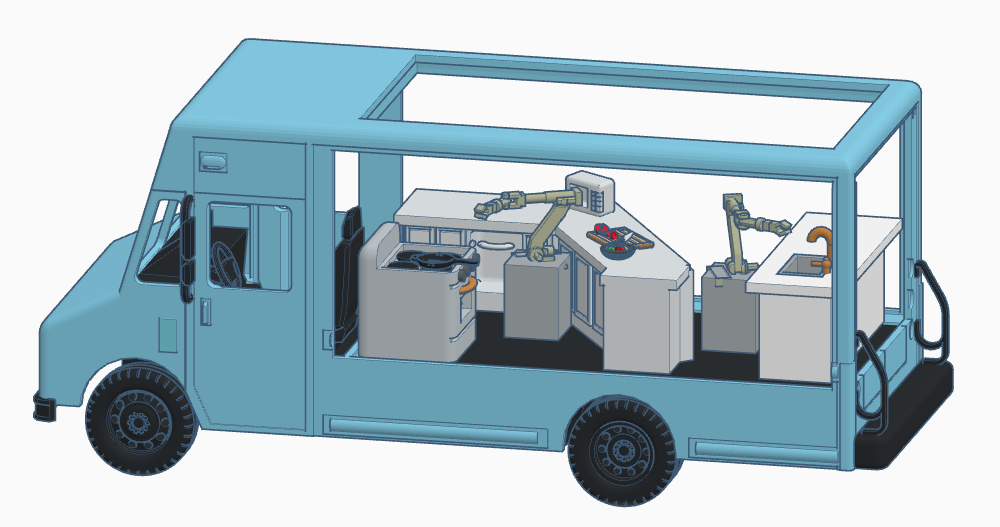

  <nav>
    <a href='#one' class="goto-next scrolly">MISSION</a>
    <a href='#two' class="goto-next scrolly">PLAN</a>
    <a href='#three' class="goto-next scrolly">VALUES</a>
    <!-- <a href='#'>BLOG</a> -->
  </nav>

<section id="header">
    <header class="major">
        <h1>{{page.title}}</h1>
        
{{page.description}}

        <a href="#one" class="button special scrolly" style="margin:20px;padding-left:15px;padding-right:15px;">Begin</a>
    </header>
    <!-- 

        <ul class="actions">
            <li></li>
        </ul>
    
 -->
</section>
<!-- One -->
<section id="one" class="main special">
    

        <!--  -->
        

            <header class="major">
                <h2>Our Mission</h2>
            </header>
            
At WORC Foods, we are building a way for our workers to see the benefit from the innovations in automation and robotics that make work easier. We are a cooperative business that is automating the most laborious tasks in food preparation and passing the financial benefit of automation directly to our workers.  In this way, we hope to usher in a new kind of economy, where our food service workers are given the freedom to make our communities better.

            
<a href="https://thespoon.tech/brookings-food-service-jobs-for-humans-in-jeopardy-as-automation-takes-hold/">Automation is coming</a> to the food service industry. If we don't plan ahead, food service jobs <a href="https://www.bbc.com/news/world-us-canada-42170100">will disappear</a> over the next 10 years, dealing a crushing economic blow. At WORC Foods, we know that food is essential, and that feeding each other is a calling. Our cafes and restaurants are more than just a place to eat, they are the places we come together. That's why we have a plan to keep our workers employed by transitioning our food service labor into value for our communities.

        

        <a href="#two" class="goto-next scrolly">Next</a>
    

</section>

<!-- two -->
<section id="two" class="main special">
    

        
        

            <header class="major">
                <h2>Our Plan</h2>
            </header>
            
Our plan is to ride the wave of food service automation while preserving the financial benefits for our workers first, not shareholders and fast-food executives. With the time and financial freedom going to workers, we can fund artist, educators, and other support to keep our communities strong.
            

            
We're launching our business with a low-cost foodtruck run as a cooperative to ensure equitable wealth stays in our community.  We're developing and implementing the robotics advances that will automate the harder parts of food prep for us. Follow the links below to learn more about our progress. 

            

                

                    <h4><a href="plan">Foodtruck designs</a></h4>
                    
                    
<a href="truck">Check out our truck design concepts.</a>

                

                

                    <h4><a href="plan">Co-op business plan</a></h4>
                    
                    
<a href="plan">Our open co-op business plan lets us show others how they can start a worker-owned foodtruck.</a>

                

                

                    <h4><a href="https://bonkerfield.org/su_chef/">Robotic Sous Chef</a></h4>
                    
                    
<a href="https://bonkerfield.org/su_chef/">Follow our progress on our robotic kitchen helper.</a>

                

            

        

        <a href="#footer" class="goto-next scrolly">Next</a>
    

</section>

<!-- Three -->
<!-- <a href="">quality service</a>, <a href="">sustainable business practices</a>, <a href="">investment in our community</a>, and <a href="">transparency in our operations</a>. -->
<section id="three" class="main special">
    

        
        

            <header class="major">
                <h2>Our Values</h2>
            </header>
            
We don't serve shareholders or owners; we serve our communities, our fellow workers, and our society. This motivates our core values: 

            <ul class="icons-grid">
                <li>
                    <a href="quality"></a>
                    <h3><a href="quality">Quality Service</a></h3>
                </li>
                <li>
                    <a href="sustainability"></a>
                    <h3><a href="sustainability">Sustainability</a></h3>
                </li>
                <li>
                    <a href="empowerment"></a>
                    <h3><a href="empowerment">Collective Empowerment</a></h3>
                </li>
                <li>
                    <a href="transparency"></a>
                    <h3><a href="transparency">Transparency</a></h3>
                </li>
            </ul>
        

        <a href="#three" class="goto-next scrolly">Next</a>
    

</section>
