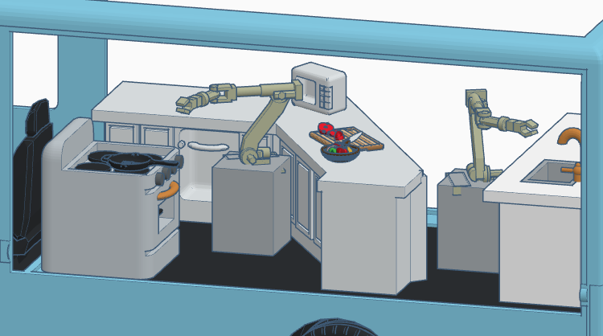
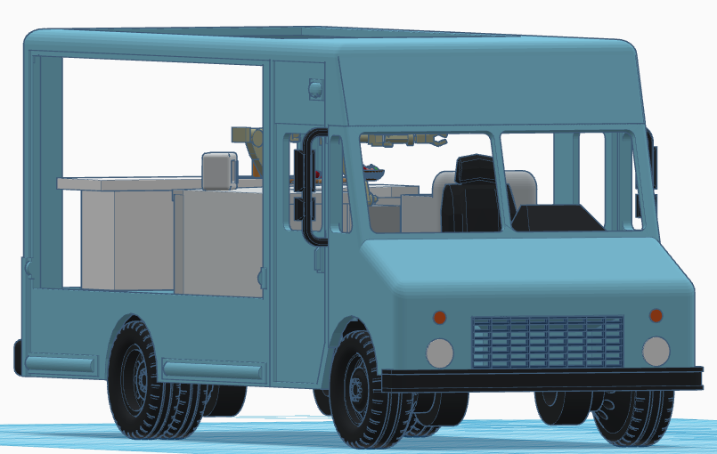

<section id="one" class="main special">
    

        <!--  -->
        

            <header class="major">
                <h2>Food Truck Design Concept</h2>
            </header>
            
We're designing our truck interior to optimize for both human and robot chefs. Check out some of our concept drawings below. 

            
            
            
            
            
Finally, you can use the interactive module below to view the concept drawings in 3D.  It may take up to 30 seconds to load.

            <iframe width="725" height="453" src="https://www.tinkercad.com/embed/2K2C7NSaw6H" frameborder="0" marginwidth="0" marginheight="0" scrolling="no"></iframe>
        

    

</section>

